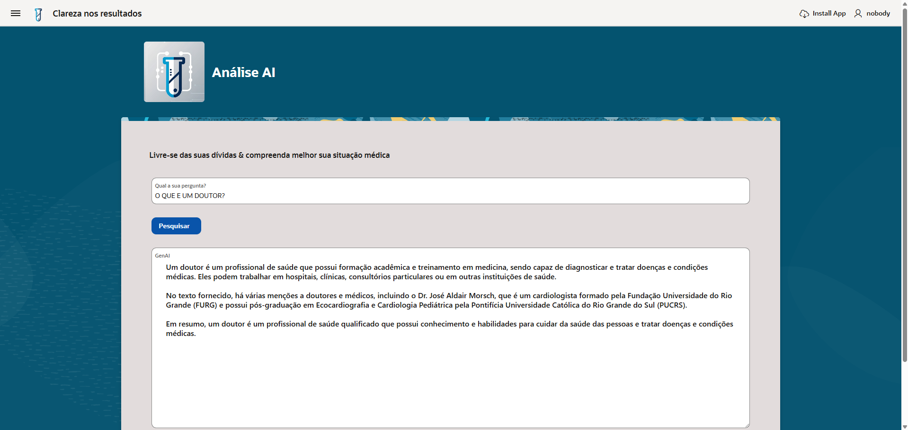

# 📊 Análise AI - Oracle APEX

Bem-vindo ao repositório do **Análise AI**, um projeto desenvolvido com **Oracle APEX**. A ideia é usar essa IA para responder a perguntas relacionadas a exames médicos, trazendo respostas precisas e baseadas em fontes confiáveis.! 🚀



## 🌟 Sobre o Projeto
O **Análise AI** tem como objetivo fornecer uma plataforma interativa para análise e interpretação de Exames Médicos. Utilizando o **Oracle APEX**, 
uma IA RAG desenvolvida no Oracle APEX, focada na Interpretação de exames médicos. Conseguimos criar uma aplicação web eficiente e acessível para qualquer usuário interessado em IA e análise de dados.

## 🛠 Tecnologias Utilizadas
- **Oracle APEX** – Desenvolvimento da aplicação web
- **PL/SQL** – Lógica e manipulação de dados
- **HTML, CSS, JavaScript** – Personalização da interface
- **Git & GitHub** – Controle de versão e colaboração

## 🚀 Como Executar o Projeto

### 1️⃣ Requisitos
Antes de começar, certifique-se de que você tem acesso a um ambiente Oracle APEX e um banco de dados compatível.

### 2️⃣ Importação da Aplicação
1. Baixe o arquivo SQL exportado do Oracle APEX.
2. Acesse o **Oracle APEX** e vá até a opção **Importar Aplicação**.
3. Faça o upload do arquivo e siga as instruções para a instalação.
4. Execute o projeto e explore as funcionalidades!

## 🏗 Contribuindo
Quer ajudar a melhorar o **Análise AI**? Siga estes passos:
1. Faça um **fork** do repositório.
2. Clone o projeto para sua máquina:
   ```bash
   git clone https://github.com/IarleySouza/AnaliseAI-OracleAPEX.git
   ```
3. Crie uma nova branch:
   ```bash
   git checkout -b minha-nova-feature
   ```
4. Faça suas alterações e commit:
   ```bash
   git commit -m "Adicionando nova funcionalidade"
   ```
5. Envie para o repositório:
   ```bash
   git push origin minha-nova-feature
   ```
6. Abra um **Pull Request** no GitHub!

## 📄 Licença
Este projeto está sob a licença **MIT** – sinta-se à vontade para usar, modificar e compartilhar!

## 💬 Contato
Se tiver dúvidas ou sugestões, entre em contato comigo:
- **GitHub**: [Danilo de Santana Alcantara](https://github.com/danalcantara)
- **LinkedIn**: [Danilo de Santana Alcantara](https://www.linkedin.com/in/danilo-alcantara-096094210/)


## 🤝 Contribuintes
Agradecimentos especiais aos contribuidores que ajudaram neste projeto:
- **Contribuinte 1** : [Andressa Prudente](https://www.linkedin.com/in/andressa-prudente-morais/)
- **Contribuinte 2** : [Danilo Alcantara](https://www.linkedin.com/in/danilo-alcantara-096094210/)
- **Contribuinte 3** : [Daniel Coutinho](https://www.linkedin.com/in/danielmcoutinho/)
- **Contribuinte 4** : [Iarley Souza](https://www.linkedin.com/in/iarley-souza/)

---
✨ *Obrigado por visitar este repositório! Fique à vontade para explorar e contribuir!* 🚀
